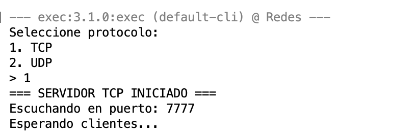
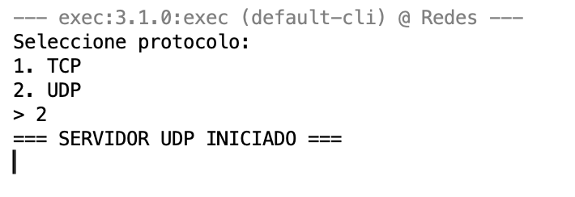
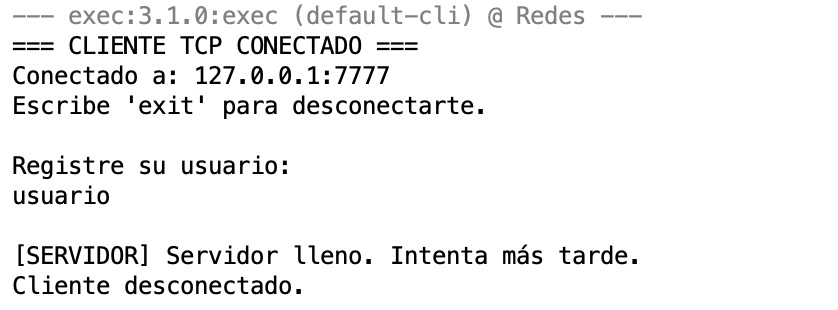
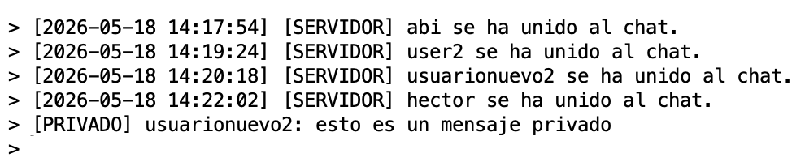
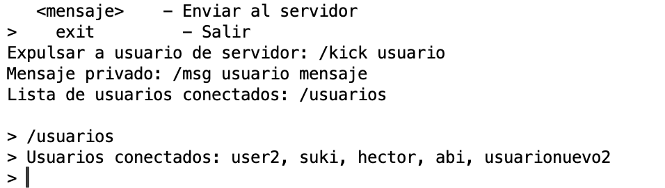

# 💬 Chat TCP/UDP en Java

> Proyecto Final · Redes  · ITSON

Aplicación de chat cliente-servidor desarrollada en Java que permite comunicación en tiempo real mediante sockets TCP y UDP, con soporte para mensajes grupales y privados entre múltiples clientes.

---

## 📋 Descripción

El sistema implementa una arquitectura cliente-servidor donde un servidor central gestiona las conexiones y retransmite mensajes entre los clientes conectados. Se utilizan hilos independientes para manejar cada cliente de forma concurrente, permitiendo que varios usuarios chatíen simultáneamente sin bloqueos.

---

## 👥 Integrantes

| Nombre | Matrícula |
|--------|-----------|
| Adriana Abigail Gómez | 00000187186 |

---

## 🛠️ Tecnologías utilizadas

- **Java 17+**
- **TCP Sockets** — conexión confiable orientada a flujo
- **UDP Sockets** — comunicación sin conexión de baja latencia
- **Multihilos** (`Thread` / `Runnable`) — manejo concurrente de clientes
- **Maven / IntelliJ IDEA / Eclipse** *(según corresponda)*

---

## 📁 Estructura del proyecto

```
chat-tcp-udp-java/
├── src/
│   ├── servidor/
│   │   ├── ServerTCP.java        # Lógica del servidor TCP y UDP
│   ├── cliente/
│   │   ├── ClientUDP.java        # Lógica del cliente UDP
│   │   ├── ClientTCP.java        # Lógica del cliente TCP
│   └── util/
│       └── Protocolo.java          # Constantes y formato de mensajes
├── screenshots/
│   ├── servidor_tcp.png
│   ├── registro_tcp1.png
│   ├── mensaje_udp.png
│   ├── listar_usuarios.png
│   ├── comando_kick.png
│   ├── cliente_expulsado.png
│   ├── mensaje_emoji.png
│   ├── mensaje_privado.png
│   └── desconexion.png
├── .gitignore
└── README.md
```

---

## 🚀 Cómo ejecutar

### Requisitos previos

- Java JDK 17 o superior instalado
- Terminal / Git Bash

### Compilar el proyecto

```bash
javac -d bin src/**/*.java
```

### Iniciar el servidor

```bash
java -cp bin servidor.ServerTCP
```

El servidor escuchará en el puerto `5000` (TCP) y `5001` (UDP) por defecto.

### Conectar un cliente

```bash
java -cp bin cliente.ClientUDP
java -cp bin cliente.ClientTCP
```

Se te pedirá ingresar la IP del servidor y tu nombre de usuario.

---

## ⚙️ Funcionalidades

- [x] Registro de usuario con nombre único
- [x] Mensajes grupales visibles para todos los conectados
- [x] Mensajes privados entre usuarios (`/msg <usuario> <mensaje>`)
- [x] Lista de usuarios conectados (`/usuarios`)
- [x] Desconexión controlada (`/salir`)

---

## 📸 Capturas de pantalla

### Servidor TCP


### Servidor UDP


### Registro de usuario


### Mensjae con emojis


### Mensaje privado


### Expulsar usuario


### Listar usuarios


---

## 🌐 Protocolo de comunicación

Los mensajes siguen el formato:

```
TIPO|ORIGEN|DESTINO|CONTENIDO
```

| Tipo | Descripción |
|------|-------------|
| `MSG` | Mensaje grupal |
| `PRIV` | Mensaje privado |
| `REG` | Registro de nuevo usuario |
| `EXIT` | Desconexión de usuario |
| `LIST` | Solicitud de lista de usuarios |

---

## 📄 Licencia

Proyecto académico — ITSON · Redes · 2026
